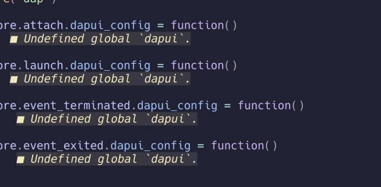

# scopes.nvim

Hierarchical, scope-based symbol navigation for Neovim.

Ever get lost scrolling through a large function, trying to remember what variables were set up at the top? scopes.nvim lets you open a picker scoped to exactly where your cursor is — see only the symbols inside your current function, class, or block, glance at what you need, then close it and land back exactly where you were.

Its hierarchical design allows you to drill into a nested block with `Tab`, go back up with `Shift-Tab`, or jump straight to any symbol with `Enter`. Think of it as a keyboard-driven alternative to sidebar outlines like Aerial, but scoped to where you are rather than showing the whole file at once.



## When is this useful?

Consider this scenario, you're deep inside a large test function. There's a bunch of fixture setup and helper variables near the top, but you don't remember the exact name of one of them. You could scroll up, lose your place, then scroll back down — or you could hit `<leader>so`, see a filtered list of everything inside that function, grab the name you need, press `q`, and be right back where you were.

Or maybe you're in a big struct method and want to quickly check what other methods are on it. Open the picker from the struct level, not the function — drill up first, browse, then jump.

The key idea: it's not just symbol jumping. It's **orienting yourself inside a scope** without losing your place.

## Why not just use Telescope or snacks symbols?

Flat symbol pickers dump every symbol in the file at once — useful for jumping across the file, less useful when you want to understand what's happening *inside* a particular function or block. Sidebar outlines (Aerial, etc.) always show the whole file, which is great for overview but noisy when you're focused on one area.

scopes.nvim gives you the same fuzzy filtering and jumping you already know, just scoped to where you actually are.

## Requirements

- Neovim >= 0.10
- [snacks.nvim](https://github.com/folke/snacks.nvim) (picker backend)
- Treesitter grammars for your language

## Installation

Using [lazy.nvim](https://github.com/folke/lazy.nvim):

```lua
{
  "alanjose10/scopes.nvim",
  dependencies = { "folke/snacks.nvim" },
  opts = {},
}
```

## Usage

```lua
require("scopes").setup({
  -- All options are optional. These are the defaults:
  backend = "auto",              -- "treesitter" | "lsp" | "auto"
  keymaps = {
    open = "<leader>so",         -- Open picker at cursor scope
    open_root = "<leader>sO",    -- Open picker at file root
  },
  picker = {
    backend = "snacks",          -- "snacks" | "telescope" (telescope is planned)
    width = 0.5,
    height = 0.4,
    border = "rounded",
  },
})
```

### Commands

| Command | Description |
|---|---|
| `:ScopeOpen` | Open scope picker at cursor position |
| `:ScopeBrowse` | Open scope picker at file root |

### Picker Keybindings

| Key | Action |
|---|---|
| `Enter` | Jump to symbol |
| `Tab` | Drill into scope |
| `Shift-Tab` | Go to parent scope |
| `Esc` / `q` | Close picker |
| Type in prompt | Fuzzy filter current scope |

A breadcrumb trail in the picker title shows your current position in the scope hierarchy (e.g., `main.go > MyStruct > HandleRequest`).

## Supported Languages

| Language | Status |
|---|---|
| Go | Phase 1 (in progress) |
| Lua | Phase 1 (in progress) |
| TypeScript | Phase 2 (planned) |
| Python | Phase 2 (planned) |

Adding a new language is a single file with Treesitter node type mappings. See `lua/scopes/languages/` for examples.

## How It Works

scopes.nvim builds a tree from your file's Treesitter parse tree, then lets you navigate that tree through a picker. Four layers, each independently testable:

1. **Language configs** — one file per language, just a table of node types and a name extractor. No logic.
2. **Tree builder** — walks the Treesitter parse tree and produces a unified `ScopeTree`. Stateless.
3. **Navigator** — state machine that tracks your current scope, breadcrumb path, and cursor position. Knows nothing about pickers.
4. **Picker integration** — thin adapter that wires the Navigator to snacks.picker. Swap this layer for Telescope support without touching anything else.

## License

MIT
