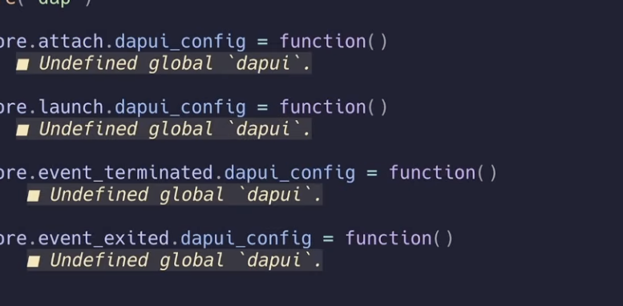

# scopes.nvim

`scopes.nvim` is an attempt at having a hierarchical tree like, scope aware navigation for Neovim.



## Why use scopes.nvim?

When working with mainly large functions and files (mostly test files), I felt the need to browse the source code like a tree. Mainly,

- Launch a picker which shows all the elements in the current scope.
- Ability to drill down an element to see the items inside its inner scope.
- Ability to go the parent scope of an item to see other elements in the parent scope.
- See a preview of the item on the side so that I can quickly peak at it without moving my cursor.

scopes.nvim lets you open a picker scoped to exactly where your cursor is — see only the symbols inside your current function, class, or block, glance at what you need, then close it and land back exactly where you were.

Its hierarchical design allows you to drill into a nested block with `Tab`, go back up with `Shift-Tab`, or jump straight to any symbol with `Enter`. Think of it as a keyboard-driven alternative to sidebar outlines like Aerial, but scoped to where you are rather than showing the whole file at once.

The key idea: it's not just symbol jumping. It's **orienting yourself inside a scope** without losing your place.

## Why not use the alternatives?

Snacks has a lsp symbols picker which shows the items in the file scope. But this does not allow you to drill down to an item. And it relies on the lsp, so there is a delay when using it in large files.

Aerial takes a different approach where it opens a side window similar to a file picker which was something I did not want to add to my vim setup.

## Requirements

- Neovim >= 0.10
- [snacks.nvim](https://github.com/folke/snacks.nvim) (picker backend)
- Treesitter grammars for your language

## Installation

Using [lazy.nvim](https://github.com/folke/lazy.nvim):

```lua
{
  "alanjose10/scopes.nvim",
  dependencies = { "folke/snacks.nvim" },
  opts = {},
}
```

## Usage

```lua
require("scopes").setup({
  -- All options are optional. These are the defaults:
  backend = "auto",              -- "treesitter" | "lsp" | "auto"
  keymaps = {
    open = "<leader>so",         -- Open picker at cursor scope
    open_root = "<leader>sO",    -- Open picker at file root
  },
  picker = {
    backend = "snacks",          -- "snacks" | "telescope" (telescope is planned)
    width = 0.5,
    height = 0.4,
    border = "rounded",
  },
})
```

### Commands

| Command | Description |
|---|---|
| `:ScopeOpen` | Open scope picker at cursor position |
| `:ScopeBrowse` | Open scope picker at file root |

### Picker Keybindings

| Key | Action |
|---|---|
| `Enter` | Jump to symbol |
| `Tab` | Drill into scope |
| `Shift-Tab` | Go to parent scope |
| `Esc` / `q` | Close picker |
| Type in prompt | Fuzzy filter current scope |

A breadcrumb trail in the picker title shows your current position in the scope hierarchy (e.g., `main.go > MyStruct > HandleRequest`).

## Supported Languages

| Language | Status |
|---|---|
| Go | Phase 1 (in progress) |
| Lua | Phase 1 (in progress) |
| TypeScript | Phase 2 (planned) |
| Python | Phase 2 (planned) |

Adding a new language is a single file with Treesitter node type mappings. See `lua/scopes/languages/` for examples.

## How It Works

scopes.nvim builds a tree from your file's Treesitter parse tree, then lets you navigate that tree through a picker. Four layers, each independently testable:

1. **Language configs** — one file per language, just a table of node types and a name extractor. No logic.
2. **Tree builder** — walks the Treesitter parse tree and produces a unified `ScopeTree`. Stateless.
3. **Navigator** — state machine that tracks your current scope, breadcrumb path, and cursor position. Knows nothing about pickers.
4. **Picker integration** — thin adapter that wires the Navigator to snacks.picker. Swap this layer for Telescope support without touching anything else.

## License

MIT
